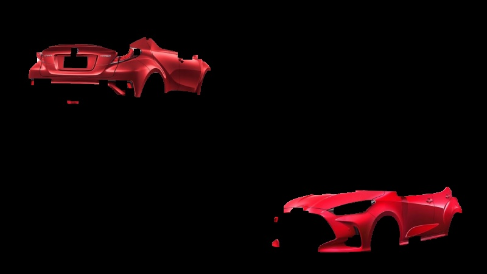
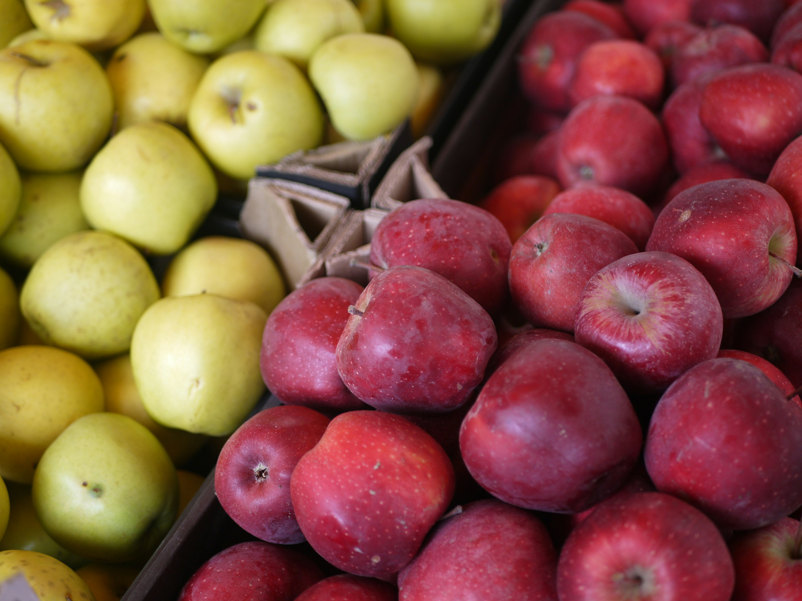
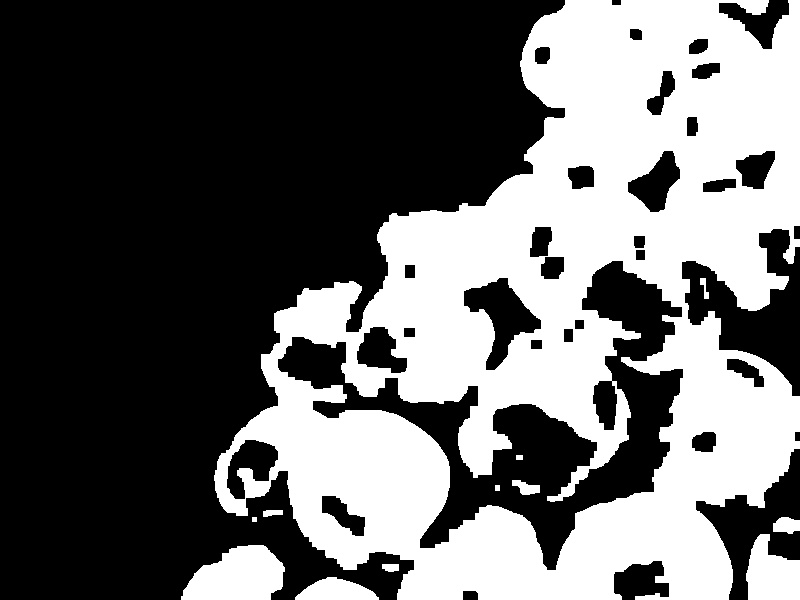
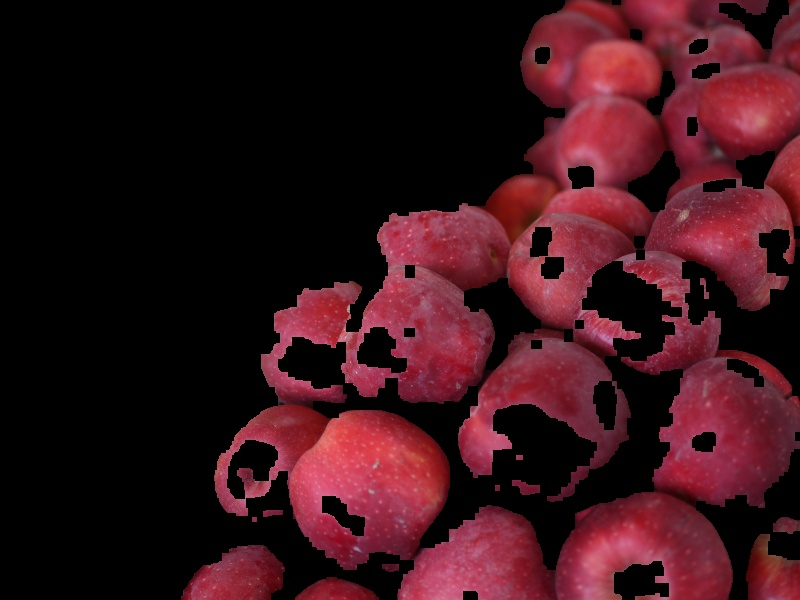
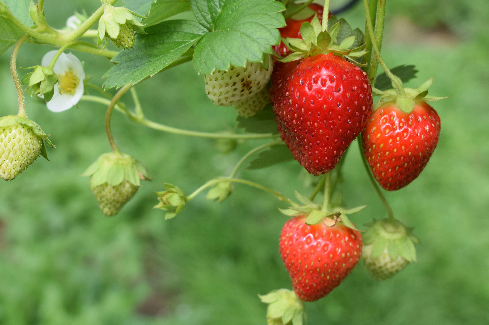
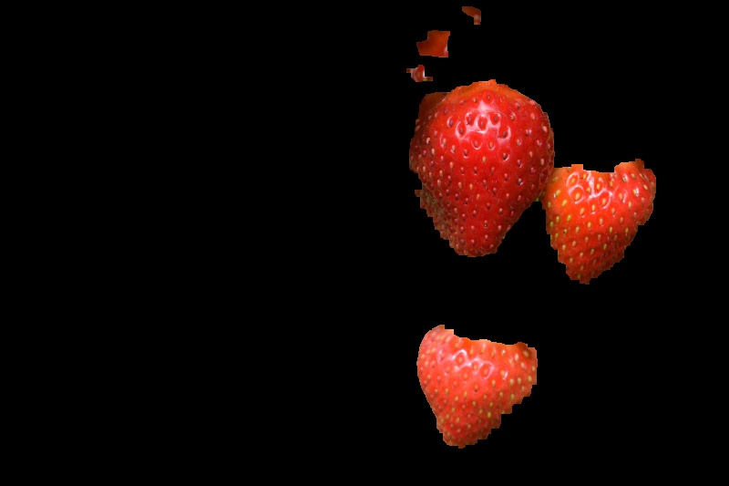

# Red Color Segmentation using Classic Computer Vision

This repository contains a professional implementation of **Red Color Segmentation** using the **OpenCV** framework on a **Raspberry Pi 4B**. Unlike standard thresholding, this project utilizes advanced HSV color-space manipulation and morphological transformations to achieve high selectivity without the need for Deep Learning.

## 🚀 Technical Highlights
* **Dual-Range HSV Thresholding**: Red is uniquely cyclic in the Hue wheel. This project implements a dual-masking technique to capture both the start (0-10) and the end (170-180) of the Hue spectrum.
* **Morphological Refinement**: Applied **Opening** (erosion followed by dilation) to eliminate salt-and-pepper noise and **Closing** (dilation followed by erosion) to bridge structural gaps in the detected objects.
* **Lighting Robustness**: Tested under simulated light and dim conditions ($0.4\times$ to $1.6\times$ Value factor) to analyze threshold sensitivity.
* **Multi-Domain Generalization**: Validated on three distinct datasets: Automotive (Toyota C-HR/Yaris), Horticulture (Apples), and Botany (Strawberries).

## 📊 Quantitative Results
The algorithm was benchmarked across various scenarios to evaluate detection accuracy (Red Pixel Ratio):

| Scenario | Automotive | Apples | Strawberries | Characteristics |
| :--- | :---: | :---: | :---: | :--- |
| **Default** | 9.16% | 41.88% | 11.85% | Optimal baseline compromise |
| **Tight** | 3.77% | 3.60% | 7.96% | High selectivity, higher False Negatives |
| **Loose** | 10.26% | 54.69% | 12.81% | High sensitivity, higher False Positives |
| **Dim (0.4x V)** | 3.58% | 7.16% | 6.86% | Significant detection drop |

## 🎨 Visual Results (Default Scenario)
The following comparisons demonstrate the pipeline's effectiveness in isolating red objects across different environments.

### 1. Automotive Dataset
| Input Image | Binary Mask | Segmentation Result |
| :---: | :---: | :---: |
|  |  |  |

### 2. Botanical Dataset (Apples & Strawberries)
| Input Image | Binary Mask | Segmentation Result |
| :---: | :---: | :---: |
|  |  |  |
|  |  |  |

## 🎥 Demonstration
Technical walkthrough and live simulation results are available on YouTube:
> 🔗 **[Watch Video Demonstration](https://youtu.be/itw2XeYJprI?si=FVZCzmi9kIulS-zZ)**

## 📂 Project Documentation
Full technical analysis and presentation slides are available in the `docs/` folder:
* **[Technical Report](docs/006_Laporan%20Segmentasi%20Warna_Ahmad%20Hanif%20Abiyyu%20Khrisna.pdf)**: Detailed methodology, HSV theory, and full experiment data.
* **[Project Presentation](docs/006_PPT_Segmentasi%20Warna.pptx)**: Visual summary of the pipeline and challenges.

## ⚙️ Requirements
* **Hardware**: Raspberry Pi 4B (aarch64) or compatible PC.
* **Software**: Python 3.11+, OpenCV 4.10.0, NumPy 2.2.4.

---
**Author**: Ahmad Hanif Abiyyu Khrisna  
**Institution**: Electronic Engineering Polytechnic Institute of Surabaya (PENS)